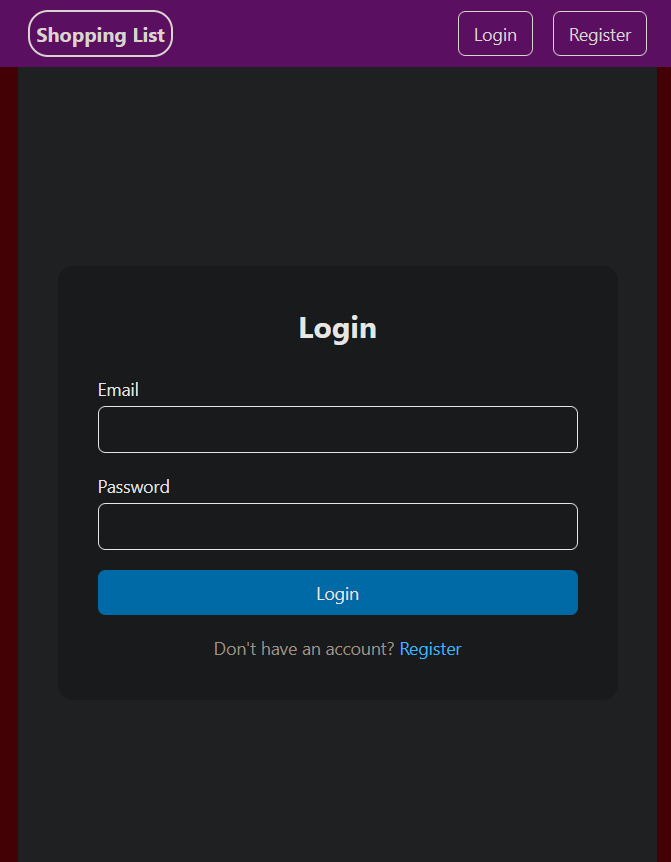

# BR-002 – No User Feedback When Session Becomes Invalid

## Source
Original GitHub Issue: https://github.com/rubiksfood/shopping-list-app/issues/2  
Project: Shopping List App  
Status: Open  

---

## Summary

When a user’s JWT becomes invalid or is removed, the application logs the user out successfully but 
provides no user-facing feedback explaining why the logout occurred.

This results in confusing user experience and does not meet expectations for graceful session handling.

---

## Related Checklist

- RC-06 – Expired or invalid sessions are handled gracefully in the UI (Fail)
- RC-09 – User receives actionable feedback on failure (Fail)

Test run reference: TR-2026-01-29-initial-regression-baseline

---

## Environment

- OS: Windows 11
- Browser: Firefox (64-bit)
- Frontend: Vite / React
- Backend: Node.js 18
- Database: MongoDB (local)

---

## Preconditions

- User is logged in with a valid session.
- A JWT token is stored in local storage.
- User is on an authenticated route.

---

## Steps to Reproduce

1. Log in successfully as a valid user.
2. Open browser developer tools.
3. Navigate to Storage → Local Storage.
4. Remove the stored JWT token.
5. Refresh the page or navigate to a protected route.

---

## Expected Result

- User is logged out and redirected to the login page.
- UI displays a clear, user-friendly message (e.g.  
  “Your session has expired. Please log in again.”).
- Behaviour should be consistent with other session-expiry scenarios.
- The user understands why they were logged out and what action to take next.

---

## Actual Result

- User is logged out and redirected to the login page.
- No explanation or feedback is shown to the user.
- Logout appears abrupt and unexplained.

---

## Evidence

Screenshot: session-logout-no-feedback.png  
Description: User is redirected to login page with no message explaining session invalidation.

---

## Impact / Severity

Severity: Medium  
Priority: P3 – Normal  

### Severity Justification

- Negatively impacts user experience.
- Unexpected logout may appear as a bug to end users.
- Does not introduce data loss, security risk, or integrity issues.
- Core authentication behaviour functions correctly.
- Primarily a UX improvement issue.

---

## Notes

- Behaviour occurs on 401 response handling.
- Behaviour observed during initial baseline regression run.
- Backend restart does not invalidate JWTs (expected for stateless JWT authentication).
- This issue concerns UX and user feedback for invalid sessions, not authentication logic itself.
- Error messaging consistency should align with other failure scenarios (e.g. network failures).