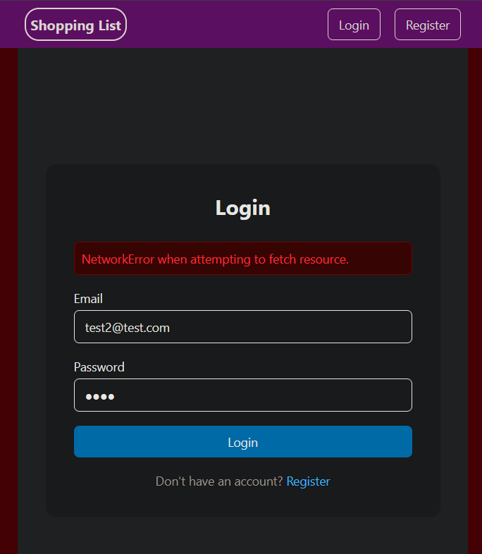
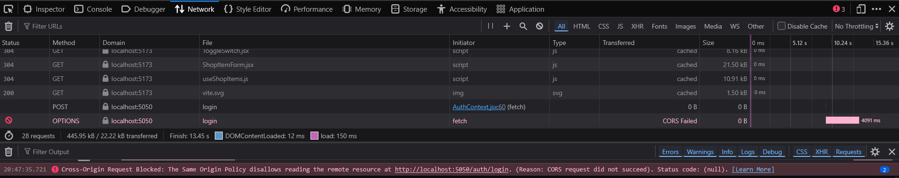

# BR-001 – Login Displays Raw Network Error When Backend Is Unavailable

## Source
Original GitHub Issue: https://github.com/rubiksfood/shopping-list-app/issues/1  
Project: Shopping List App  
Status: Open  

---

## Summary

When the backend service is unavailable, attempting to log in results in a browser-native network error message 
being displayed in the UI instead of a controlled, user-friendly application message.

This exposes technical details to the end user and provides no actionable guidance.

---

## Related Checklist

- RC-07 – Backend errors surfaced to UI in a controlled manner (Fail)
- RC-09 – User receives actionable feedback on failure (Fail)

Test run reference: TR-2026-01-29-initial-regression-baseline

---

## Environment

- OS: Windows 11
- Browser: Firefox 147.02 (64-bit)  
- Frontend: Vite / React
- Backend: Node.js 18 (local, intentionally stopped)
- Database: MongoDB (local)

---

## Preconditions

- Application is running.
- Backend server is intentionally stopped before login attempt.
- User is on the login page.

---

## Steps to Reproduce

1. Open the application and navigate to the login page.
2. Stop the backend server.
3. Enter valid login credentials.
4. Click “Log in”.

---

## Expected Result

- The UI displays a controlled, application-level error message  
  (e.g. “Service temporarily unavailable. Please try again later.”).
- No raw browser or network error messages are exposed.
- The user understands what happened and what to do next.

---

## Actual Result

- The UI displays a browser-native network error message  
  (e.g. “NetworkError when attempting to fetch resource.”).
- Network tab shows failed POST /login request and CORS preflight failure.
- No user-friendly recovery guidance is provided.

---

## Evidence

Screenshot: login-network-error-firefox.png  
Description: Raw browser network error displayed in login UI.  

Screenshot: network-login-cors-failed.png  
Description: Network tab showing failed POST /login request and CORS preflight failure.  

---

## Impact / Severity

Severity: Medium  
Priority: P2 – High  

### Severity Justification

- Blocks login during backend outages.
- Exposes technical error messages to end users.
- Negatively impacts user experience and perceived quality.
- No data loss, security exposure, or integrity issue identified.

---

## Notes

- Behaviour observed during initial baseline regression run.
- Backend restart does not invalidate JWTs (expected for stateless JWT auth).
- Error message content may vary slightly by browser, but the underlying issue remains the same.
- This issue concerns frontend error handling and user feedback when requests fail, rather than authentication logic.